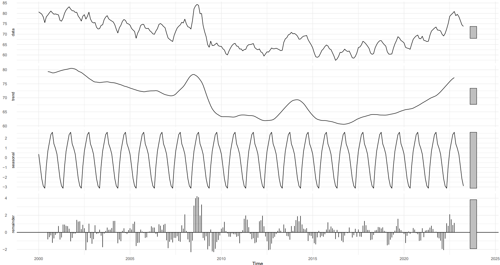

# Milch Price Forecasting Model

The Milk Price Forecasting Model is a pilot project of the Federal
Office for Agriculture. It is implemented in an R script. It integrates
various statistical and machine learning models, offering a detailed
analysis of milk price trends and predictions.

## User Guide

The excel file `milk-price-data.xlsx` with the relevant data must be
placed in the `data` directory for the script to function correctly.
Note that future values may be added directly to that table, but header
names must remain the same. Running the script in an R environment will
trigger a series of processes including data preprocessing, model
training and evaluation, and the generation of visualizations and
reports.

The output from the script is multi-faceted: two PDF reports will be
written into a directory `reports`. The file
`time-series-decomposition.pdf` summarizes the data and visualizes the
seasonal decomposition of each variable. The file
`machine-learning-report.pdf` summarizes the statistical models applied
and their respective forecastings. In addition, various tables with
numerical results are written into the directory `tables`.

<table style="width:100%;">
<colgroup>
<col style="width: 33%" />
<col style="width: 33%" />
<col style="width: 33%" />
</colgroup>
<tbody>
<tr class="odd">
<td style="text-align: center;">

<figure>

<figcaption
aria-hidden="true"><code>correlations.xlsx</code></figcaption>
</figure>

</td>
<td style="text-align: center;">

<figure>

<figcaption
aria-hidden="true"><code>correlations.xlsx</code></figcaption>
</figure>

</td>
<td style="text-align: center;">

<figure>

<figcaption
aria-hidden="true"><code>correlations.xlsx</code></figcaption>
</figure>

</td>
</tr>
</tbody>
</table>

<table style="width:67%;">
<colgroup>
<col style="width: 33%" />
<col style="width: 33%" />
</colgroup>
<tbody>
<tr class="odd">
<td style="text-align: center;">

<figure>

<figcaption
aria-hidden="true"><code>machine-learning-report.pdf</code></figcaption>
</figure>

</td>
<td style="text-align: center;">

<figure>

<figcaption
aria-hidden="true"><code>time-series-decomposition.pdf</code></figcaption>
</figure>

</td>
</tr>
</tbody>
</table>

Figure 1: Overview of the different files written by the R script
`script.R`.

This documentation encapsulates the script’s capabilities, underlying
principles, and offers guidance for users to leverage its
functionalities effectively.

# How The Script Works

## Setup

The script begins by setting up the necessary data environment, using
`milk-price-data.xlsx` as its primary data source. It specifically
targets `CH_Milchpreis` for prediction, reserving the final 18 months of
data for testing. This number may be adjusted via the variable
`test_set_size`.

The script incorporates a broad spectrum of features, encompassing
various milk price types and related economic indicators, allowing for a
comprehensive analysis.

## Seasonal Decomposition

This part of the script breaks down the time-series data into trend,
seasonal, and residual elements, offering valuable insights into the
underlying patterns that govern milk price changes. It repeats this with
every single variable in the data, so long seasonal effects are detected
([Figure 2](#fig-seasonal)).

<figure>

<figcaption aria-hidden="true">Figure 2: Example of a seasonal
decomposition plot for <code>CH_Milchpreis</code>. The milk price is
decomposed into a trend (via a moving average), a seasonal effect and
the remainder. The bars on the right indicate the relative magnitude of
the effects.</figcaption>
</figure>

## Data Analysis and Visualization

Data visualization and analysis are integral parts of the script. It
includes comprehensive code segments for visually representing the
performance of various models and their forecast accuracy. This visual
comparison is crucial for understanding the effectiveness of each model.
All plots generated by the script are written into the file
`machine-learning-report.pdf`.

The script also features a time-series decomposition component. This
section breaks down the time-series data into trend, seasonal, and
residual elements, offering valuable insights into the underlying
patterns that govern milk price changes.

## Milk Price Forecasting

For the milk price forecasting, four different models are fit to the
data: A lasso regression model, a ridge regression model, an ARIMA model
as well as a SARIMA model.

### Data preparation

First, the data is prepared: The `time` feature is replaced by
respective sine and cosine transformations. The target variable,
i.e. `CH_Milchpreis`, is lagged with different forecast horizons,
`h = 1`, `h = 2`, and `h = 3`. All `NA` values in the features are
replaced by zero – except for the ones created by lagging the target
variable.

Next, all original features are z-score normalized. This ensures a more
reliable model fitting and also equivalent variable weight.

The prepared data is split into training and testing sets. The training
set consists of all data up until `test_set_size = 18` months before the
last entry. These observations are used to calibrate the model.
Correspondingly, the latest `test_set_size = 18` observations are used
to test the model.

### Forecasting with lasso and ridge regression

Generally speaking, any forecasting model $f$ predicts a future value of
$X$, say $X_{t+1}$, based on a past value $X_t$. Autoregressive models
predict following values based on the predictions already made
recursively. For the ridge and lasso regression models, this is not
possible: They only predict the Swiss milk price (denoted as
$X_{1,t+h}$), while needing many other values
([Equation 1](#eq-forecasting)). This means, after one round of
predicting, these other values are missing for continueing
autoregressively.

$$
f: X_{1,t+h} = \beta_0 + \sum_{i=1}^p \beta_i X_{i,t}
 \qquad(1)$$

For the purpose of predicting milk prices more than one month into the
future, three different models are trained – each with a different
forecast horizons $h$. Consequently, three instances per model can be
compared with each other in the end.

The hyperparameter $\lambda$ which is penalizing large coefficients, is
selected via cross-validation with the function `cv.glmnet` from the
`glmnet` package. In order to prevent overfitting, the folds are chosen
as six-month batches instead of randomly.

### Forcasting with (seasonal) ARIMA

As the name says, the autoregressive integrated moving average (ARIMA)
model is autoregressive. Thus, it can forecast values for how many
periods as we want it to. For the purpose of comparing ARIMA and SARIMA
models with the regularized models, the same forecast horizon is chosen.

### Model evaluation

# Details About the Implemented Models

A significant part of the script is dedicated to implementing and
fine-tuning different statistical models: two regularization models
(Ridge and Lasso regression), and an autoregressive integrated moving
average (ARIMA) model, both with and without seasonal effects.

## Regularized Least Squares

Ridge and Lasso regression are especially effective in handling
multicollinearity and preventing overfitting. Both models are linear in
nature, i.e. the response variable $\mathbf y$ can be expressed as a
linear combination of predictors $\mathbf X \boldsymbol \beta$ plus some
residual $\boldsymbol \varepsilon$.

$$\mathbf y = \mathbf X \boldsymbol \beta + \boldsymbol \varepsilon \qquad(2)$$

Ridge Regression introduces an $\ell_2$-penalty proportional to the
square of the coefficient magnitudes. On the other side, Lasso
Regression employs an $\ell_1$-penalty, encouraging sparser solutions –
only a few predictors are selected.

$$\boldsymbol {\hat \beta}_{\text{ridge}} = \min_{\boldsymbol \beta} \left\{ \| \mathbf y - \mathbf X \boldsymbol \beta \|_2^2 + \lambda \| \boldsymbol \beta\|_2^2 \right\}$$

$$\boldsymbol {\hat \beta}_{\text{lasso}} = \min_{\boldsymbol \beta} \left\{ \| \mathbf y - \mathbf X \boldsymbol \beta \|_1 + \lambda \| \boldsymbol \beta\|_2^2 \right\}$$

The mathematical formulations for these regressions are centered around
minimizing the sum of squared residuals, with added regularization terms
($\ell_2$-norm for Ridge and $\ell_1$-norm for Lasso).

## Autoregressive Integrated Moving Average

Additionally, the script employs an Autoregressive Integrated Moving
Average (ARIMA) and its seasonal variant (SARIMA), which are both
pivotal for time-series forecasting. ARIMA is most suitable for
non-seasonal data and combines autoregressive and moving average
components. In contrast, SARIMA extends this to accommodate seasonal
fluctuations in data, making it more robust for datasets with seasonal
trends.
