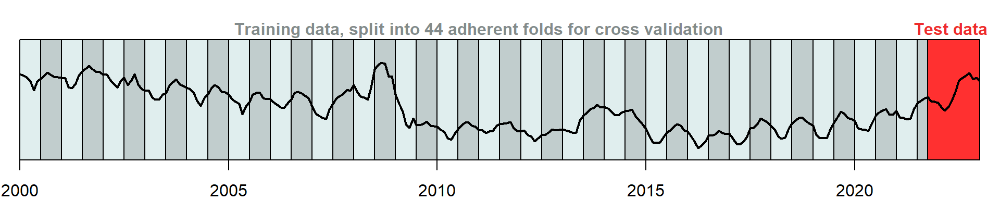

# Milk Price Forecasting Model

The Milk Price Forecasting Model is a pilot project of the Federal
Office for Agriculture. It is implemented in an R script. It integrates
various statistical and machine learning models, offering a detailed
analysis of milk price trends and predictions.

## User Guide

In order to run the milk price forecasting model, a few conditions must
be met:

-   The excel file `milk-price-data.xlsx` with the relevant data must be
    found in the same directory as the R script.
-   Additional values may be added directly to the excel file, but
    header names must remain the same.
-   Before running the R script, the working directory must be set
    correctly.

Running the R script will trigger a series of processes including data
preprocessing, model training and evaluation, and the generation of
visualizations and reports.

The output from the script is multi-faceted – but everything will be
written into a directory called `output`. Two PDF reports are produced:
the file `time-series-decomposition.pdf` summarizes the data and
visualizes the seasonal decomposition of each variable, while
`machine-learning-report.pdf` summarizes the models applied and their
respective forecastings. In addition, various tables with numerical
results are written into the directory `output`.

<table style="width:100%;">
<colgroup>
<col style="width: 33%" />
<col style="width: 33%" />
<col style="width: 33%" />
</colgroup>
<tbody>
<tr class="odd">
<td style="text-align: center;">

<figure>

<figcaption
aria-hidden="true"><code>correlations.xlsx</code></figcaption>
</figure>

</td>
<td style="text-align: center;">

<figure>

<figcaption
aria-hidden="true"><code>correlations.xlsx</code></figcaption>
</figure>

</td>
<td style="text-align: center;">

<figure>

<figcaption
aria-hidden="true"><code>correlations.xlsx</code></figcaption>
</figure>

</td>
</tr>
</tbody>
</table>

<table style="width:67%;">
<colgroup>
<col style="width: 33%" />
<col style="width: 33%" />
</colgroup>
<tbody>
<tr class="odd">
<td style="text-align: center;">

<figure>

<figcaption
aria-hidden="true"><code>machine-learning-report.pdf</code></figcaption>
</figure>

</td>
<td style="text-align: center;">

<figure>

<figcaption
aria-hidden="true"><code>time-series-decomposition.pdf</code></figcaption>
</figure>

</td>
</tr>
</tbody>
</table>

Figure 1: Overview of the different files written into the directory
`output` by the R script `script.R`.

This documentation encapsulates the script’s capabilities, underlying
principles, and offers guidance for users to leverage its
functionalities effectively.

# How does the script work?

## Setting up the work space

The script begins by setting up the necessary data environment, using
`milk-price-data.xlsx` as its primary data source. By default, it
specifically targets `CH_Milchpreis` for prediction—although this might
be changed by adjusting the variable `target`—, reserving the final 18
months of data for testing. This number can be adjusted via the variable
`test_set_size`.

The models incorporate a broad spectrum of features, encompassing
various milk price types and related economic indicators, allowing for a
comprehensive analysis.

## Exploratory data analysis

The first part of the code generates a PDF file called
`time-series-decomposition.pdf`. As the name suggests, this file mainly
incorporates seasonal decompositions, but also some more exploratory
analyses.

### Correlation matrix and missing values

The PDF report starts by showing a visualization of all missing values
in the data later used to train the forecasting models. This simply
serves as an overview – for the purpose of forecasting, `NA` values are
replaced by zero.

Next, the report produces a correlation matrix of all features in the
data set ([Figure 2](#fig-correlations)). Positively correlating
features are higlighted in red, negatively correlated features in blue.
As to be seen, most features are either positively or negatively
correlated with each other – ther are relatively few uncorrelated
variabels. This means we are dealing with a high degree of
multicollinearity in the feature matrix.

<figure>

<figcaption aria-hidden="true">Figure 2: Visualization of the
correlation matrix of the feature data set. As to be seen, there are
many positively and negatively correlating features – as well as some
that are seemingly independent from the others.</figcaption>
</figure>

### Seasonal decomposition

The next part generates plots of a seasonal decomposition of the data
([Figure 3](#fig-seasonal)). It breaks down the time-series into trend,
seasonal, and residual elements, offering insights into the underlying
patterns that govern changes over time.

<figure>

<figcaption aria-hidden="true">Figure 3: Example of a seasonal
decomposition plot for <code>CH_Milchpreis</code>. The milk price is
decomposed into a trend (via a moving average), a seasonal effect and
the remainder. The bars on the right indicate the relative magnitude of
the effects.</figcaption>
</figure>

Time series plots are generated for every single feature. However, if no
significant seasonal effect is detected using Ollech and Webel’s
combined seasonality test, the plot shows the feature value over time
only ([Ollech 2021](#ref-seastests2021); [Ollech and Webel
2020](#ref-ollech2020)).

## Forecasting the Swiss milk price

### Data preparation

First, the data is prepared: The `time` feature is replaced by
respective sine and cosine transformations. The target variable,
i.e. `CH_Milchpreis`, is lagged with different forecast horizons,
`h = 1`, `h = 2`, and `h = 3`. All `NA` values in the features are
replaced by zero – except for the ones created by lagging the target
variable.

Furthermore, all original features are z-score normalized. This ensures
a more reliable model fitting and also equivalent variable weight.

### Evaluation

To evaluate the different forecasting models, the root mean squared
error is used (RMSE, [Equation 1](#eq-rmse)). It compares the predicted
values of the milk price for any following period ($\hat x_{t+1}$) with
the recorded value ($x_{t+1}$).

$$\text{RMSE} = \sqrt{\frac{1}{n} \sum_{t=1}^{n} \left( x_{t+1} - \hat x_{t+1} \right)^2} \qquad(1)$$

One apparent advantage of the RMSE as a performance metric is its
interpretability – it shares the same unit as the variable of interest
(i.e., CHF) and represents the expected absolute deviation.

The prepared data is split into training and testing sets. The training
set consists of all data up until `test_set_size = 18` months before the
last entry. These observations are used to calibrate the model.
Correspondingly, the latest `test_set_size = 18` observations are used
to test the models. In the `machine-learning-report.pdf` file, the model
performance on the test set is reported ([Figure 4](#fig-performance)).

<figure>

<figcaption aria-hidden="true">Figure 4: Performance metric (RMSE) for
the four employed machine learning models – each for a forecasting
horizon of h = 1, 2, and 3 months.</figcaption>
</figure>

The machine learning models are trained using cross-validation. As time
series data, the values are heavily autocorrelated over time. To avoid
overfitting, the folds for cross-validation are split over time,
specifically in six month periods ([Figure 5](#fig-crossvalidation)).

<figure>

<figcaption aria-hidden="true">Figure 5: Visualization of the data
division into test and training data, as well as the subdivision into
folds of the training data for cross validation.</figcaption>
</figure>

The pairs panel also included in the `machine-learning-report.pdf` file
also illustrates the performance of the different models
([Figure 6](#fig-pairs)). Furthermore, it shows how different model
predictions are correlated – lasso and ridge regression make similar
predictions, and so do the ARIMA and SARIMA models.

<figure>

<figcaption aria-hidden="true">Figure 6: Pair panels of the different
model predictions as well as the observed values for a forecasting
horizon of h = 1.</figcaption>
</figure>

For the milk price forecasting, four different models are fit to the
data: A lasso regression model, a ridge regression model, an ARIMA model
as well as a SARIMA model. These models are briefly described here.

### Forecasting with lasso and ridge regression

Generally speaking, any forecasting model $f$ predicts a future values
of $X$, say $X_{t+1}$, based on a past value $X_t$. Autoregressive
models such as ARIMA and SARIMA predict following values based on the
predictions already made recursively. For the ridge and lasso regression
models, this is not possible: They only predict the Swiss milk price
(denoted as $X_{1,t+h}$), while using many other features
([Equation 2](#eq-forecasting)). This means, after one round of
predicting, these other values are missing for continueing
autoregressively.

$$f: X_{1,t+h} = \beta_0 + \sum_{i=1}^p \beta_i X_{i,t} \qquad(2)$$

For the purpose of predicting milk prices more than one month into the
future, three different models are trained in the script – each with a
different forecast horizons $h$. Consequently, three instances per model
can be compared with each other in the end.[^1]

Ridge and Lasso regression are especially effective in handling
multicollinearity and preventing overfitting. Both models are linear in
nature, i.e. the response variable $\mathbf y$ can be expressed as a
linear combination of predictors $\mathbf X \boldsymbol \beta$ plus some
residual $\boldsymbol \varepsilon$.

$$\mathbf y = \mathbf X \boldsymbol \beta + \boldsymbol \varepsilon \qquad(3)$$

Ridge Regression introduces an $\ell_2$-penalty proportional to the
square of the coefficient magnitudes. On the other side, Lasso
Regression employs an $\ell_1$-penalty, encouraging sparser solutions –
only a few predictors are selected.

$$\boldsymbol {\hat \beta}_{\text{ridge}} = \min_{\boldsymbol \beta} \left\{ \| \mathbf y - \mathbf X \boldsymbol \beta \|_2^2 + \lambda \| \boldsymbol \beta\|_2^2 \right\} \qquad \boldsymbol {\hat \beta}_{\text{lasso}} = \min_{\boldsymbol \beta} \left\{ \| \mathbf y - \mathbf X \boldsymbol \beta \|_1 + \lambda \| \boldsymbol \beta\|_2^2 \right\} \qquad(4)$$

The mathematical formulations for these regressions are centered around
minimizing the sum of squared residuals, with added regularization terms
($\ell_2$-norm for Ridge and $\ell_1$-norm for Lasso).

The hyperparameter $\lambda$ which is penalizing large coefficients, is
selected via cross-validation with the function `cv.glmnet` from the
`glmnet` package. [Figure 7](#fig-coefficients) shows the magnitude of
the coefficients under $\ell_1$ penalty (lasso regression), and $\ell_2$
penalty (ridge regression).

<figure>

<figcaption aria-hidden="true">Figure 7: Visualization of the
coefficient magnitude under ℓ1 penalty (lasso regression), and
ℓ2 penalty (ridge
regression).</figcaption>
</figure>

[Figure 8](#fig-regularization) shows both the cross-validated error as
well as the coefficient magnitude as a response to an increasing penalty
term $\lambda$. As to be seen, lasso regression leads to coefficients
reaching zero one by one, while they only approach zero (but never reach
it) with ridge regression.

<figure>

<figcaption aria-hidden="true">Figure 8: Cross-validated mean squared
error as a response to an increasing penalty term <em>λ</em> (top) as well as the magnidude of
different coefficients as a response to an increasing penalty term <em>λ</em> (bottom).</figcaption>
</figure>

### Forcasting with (seasonal) ARIMA

Additionally, the script employs an autoregressive integrated moving
average (ARIMA) and its seasonal variant (SARIMA). ARIMA is most
suitable for non-seasonal data and combines autoregressive and moving
average components. In contrast, SARIMA extends this to accommodate
seasonal fluctuations in data, making it more robust for datasets with
seasonal trends.

The two models are mainly fit to have a benchmark for the ridge and
lasso regressio models.

Both models are fit using the `arima` function from the R package
`stats`. In both cases, the order ($p$, $d$, $q$) needs to be specified.
$p$ is the moving average order, $d$ the degree of differencing, and $q$
the autoregressive order. In both models, and also the seasonal
component, the order is set to $p = 1$, $d = 1$ and $q = 1$.

Ollech, Daniel. 2021. *Seastests: Seasonality Tests*.
<https://CRAN.R-project.org/package=seastests>.

Ollech, Daniel, and Karsten Webel. 2020. “A Random Forest-Based Approach
to Identifying the Most Informative Seasonality Tests.”

[^1]: The autoregressive models (ARIMA and SARIMA) don’t need to be
    retrained for specific forecasting horizons, they can simply
    forecast next values based on the already forecast ones. Thus, the
    ARIMA and SARIMA models are only trained once.
